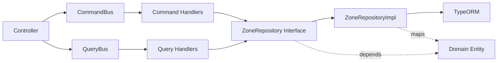
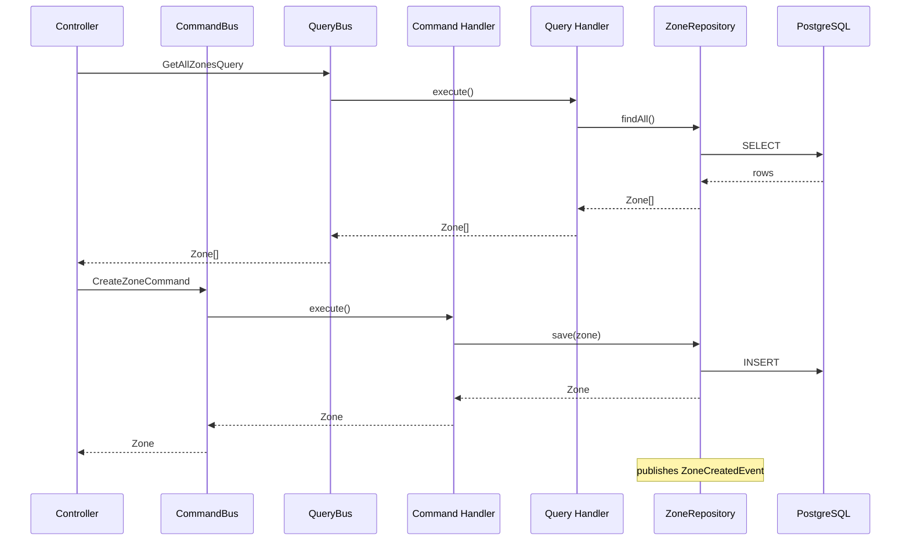

# Green Algeria Map

Map-based platform for tracking reforestation and cleanup efforts across Algeria. Volunteers, donors, and organizers can find planting zones, track progress, and coordinate action.

## Stack

| Layer | Tech |
|-------|------|
| **Frontend** | React 19, TanStack Router, Tailwind CSS v4, shadcn/ui, Leaflet |
| **Backend** | NestJS 11, CQRS (`@nestjs/cqrs`), TypeORM, PostgreSQL 18 |
| **Auth** | BetterAuth + `@thallesp/nestjs-better-auth` |
| **Quality** | TypeScript strict, ESLint, Prettier, knip, depcruise, husky |
| **CI** | GitHub Actions — frontend + backend workflows with path filters |
| **Runtime** | Docker (PostgreSQL), pnpm, Bun |

## Quick Start

```bash
# Start everything (DB → migrations → seed → services in tmux)
./start-dev.sh

# Or manually:
cd backend-nestjs && docker compose up -d db
pnpm migration:run
bun src/seed.ts
pnpm start:dev

cd frontend && pnpm dev
```

## Architecture

### Clean Architecture Layers



| Layer | Responsibility | Location |
|-------|---------------|----------|
| **Presentation** | Controllers, DTOs, auth decorators | `zones.controller.ts`, `dto/` |
| **Application** | Commands, queries, event handlers | `application/{commands,queries,events}/` |
| **Domain** | Entities, value objects, repository interfaces | `domain/` |
| **Infrastructure** | TypeORM entities, mappers, repository impls | `infrastructure/` |

### CQRS Flow



- Zone GET routes are `@AllowAnonymous()` (public), writes require auth

## Frontend Scripts

Run from `frontend/`:

| Command | Description |
|---------|-------------|
| `pnpm dev` | Dev server (port 3000) |
| `pnpm build` | Production build |
| `pnpm check` | Type check |
| `pnpm lint` | ESLint |
| `pnpm knip` | Dead code detection |
| `pnpm depcruise` | Module boundary validation |
| `pnpm format` | Prettier |

## Backend Scripts

Run from `backend-nestjs/`:

| Command | Description |
|---------|-------------|
| `pnpm start:dev` | Dev server (port 8080, watch mode) |
| `pnpm build` | Compile to dist/ |
| `pnpm check` | Type check |
| `pnpm lint` | ESLint |
| `pnpm knip` | Dead code detection |
| `pnpm depcruise` | Circular dependency detection |
| `pnpm test` | Jest tests |
| `pnpm migration:generate` | Generate migration from entity changes |
| `pnpm migration:run` | Apply pending migrations |
| `pnpm migration:revert` | Revert last migration |
| `bun src/seed.ts` | Seed demo data (10 zones) |

API docs at `http://localhost:8080/api/docs` (Scalar, moon theme).

### Auth Endpoints

| Method | Path | Description |
|--------|------|-------------|
| POST | `/api/auth/sign-up/email` | Register with email + password |
| POST | `/api/auth/sign-in/email` | Sign in, returns session cookie |
| GET | `/api/auth/get-session` | Get current session |
| POST | `/api/auth/sign-out` | Sign out |

## Project Structure

```
green-algeria-map/
├── frontend/                 # React SPA
│   ├── src/
│   │   ├── api/              # API client modules
│   │   ├── components/       # Map components + shadcn/ui
│   │   ├── hooks/            # Custom hooks
│   │   ├── lib/              # Utilities
│   │   ├── routes/           # TanStack Router routes
│   │   └── types/            # Shared TypeScript types
│   └── ...
├── backend-nestjs/           # NestJS CQRS API
│   ├── src/
│   │   ├── auth.ts           # BetterAuth instance
│   │   ├── data-source.ts    # TypeORM DataSource for migrations
│   │   ├── seed.ts           # Demo data seeder
│   │   ├── migrations/       # TypeORM migrations
│   │   └── modules/zones/
│   │       ├── domain/       # Zone entity, value objects, repository interface
│   │       ├── application/  # Commands, queries, events, handlers
│   │       ├── infrastructure/ # TypeORM entity, mapper, repository impl
│   │       ├── dto/          # Request validation DTOs
│   │       ├── zones.controller.ts
│   │       └── zones.module.ts
│   └── ...
├── .github/workflows/        # CI (frontend + backend)
├── start-dev.sh              # Dev environment launcher
└── .tmux.conf                # Tmux config
```

## CI

| Workflow | Triggers | Jobs |
|----------|----------|------|
| CI (frontend) | Changes in `frontend/` or `ci.yml` | check → lint → knip → depcruise → test → build |
| CI Backend | Changes in `backend-nestjs/` or `ci-backend.yml` | check → lint → knip → depcruise → test → build |

## Status

- Interactive Leaflet map with 10 demo zones, color-coded by status
- Dark mode, legend, zoom controls, status popups
- NestJS 11 backend with CQRS + TypeORM + PostgreSQL
- BetterAuth email/password authentication
- Zone CRUD API + Scalar docs
- TypeORM migration workflow + seed script
- CI split, depcruise, pre-commit hooks
- Clean architecture: domain/application/infrastructure layers
- Frontend auth integration (sign-in/up pages, protected routes)

## License

MIT
